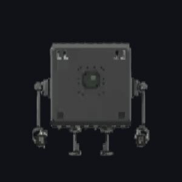

# libavrll


A lightweight AVR driver library focused on low-level control and reusable embedded components without Arduino-level abstraction.

---

## Goals

- Provide reusable low-level drivers (GPIO, UART, SPI, I2C)
- Maintain full register-level transparency
- Avoid unnecessary abstraction and overhead
- Ensure predictable and deterministic behavior
- Build a personal, reusable embedded systems toolkit

---

## Features

- [ ] GPIO driver (digital read/write, direction control)
- [ ] UART driver
- [ ] SPI driver
- [ ] I2C (TWI) driver
- [ ] Timer utilities
- [ ] Button debounce module
- [ ] Sensor drivers (BMP, RTC, etc.)

---

## Getting Started

### Requirements

- `avr-gcc`
- `avr-libc`
- `make`
- `avrdude`

### Build

```bash
make
```

### Flash (example for ATmega328P)

```bash
avrdude -c usbasp -p atmega328p -U flash:w:main.hex
```

---

## Example

```c
#include "gpio.h"

int main(void)
{
    gpio_pinMode(DDRB, PB5, OUTPUT);

    while (1)
    {
        gpio_toggle(PORTB, PB5);
    }
}
```

---

## Design Philosophy

- No hidden abstractions; direct mapping to hardware registers
- Minimal overhead
- Deterministic execution
- Modular and reusable driver design
- Focus on embedded systems engineering, not rapid prototyping

---

## Roadmap

- [ ] Complete core drivers (GPIO, UART, SPI, I2C)
- [ ] Add timer and interrupt abstractions
- [ ] Develop sensor driver modules
- [ ] Create lab-based examples and documentation
- [ ] Improve portability across AVR families

---

## Contributing

Currently maintained by a single developer.

Contributions are welcome:
- Bug fixes
- Driver improvements
- Documentation enhancements

---

## Author

Toghrul Quluzadə  
Embedded Systems Developer

LinkedIn: https://www.linkedin.com/in/toghrul-guluzade/

---

## License

This project is licensed under the MIT License.
